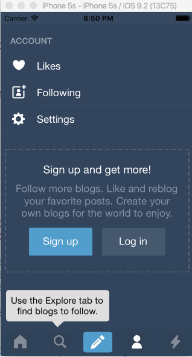

# AB_HW_Week4_v1
Week # 4 Homework

This is a demo of tumblr tab navigation

Time spent: 7 hours spent in total

Completed user stories:

 * [x] Required: Tapping on Home, Search, Account, or Trending should show the respective screen and highlight the tab bar button.
 * [x] Required: Compose button should modally present the compose screen.
 * [x] Optional: Compose screen is faded in while the buttons animate in.
 * [x] Optional: Login button should show animate the login form over the view controller.
 * [x] Optional: Discover bubble should bob up and down unless the SearchViewController is tapped.
 
Notes:

Spent some time making the UI work across multiple phone resolutions by playing around with the RelativeLayout.

Walkthrough of all user stories:

